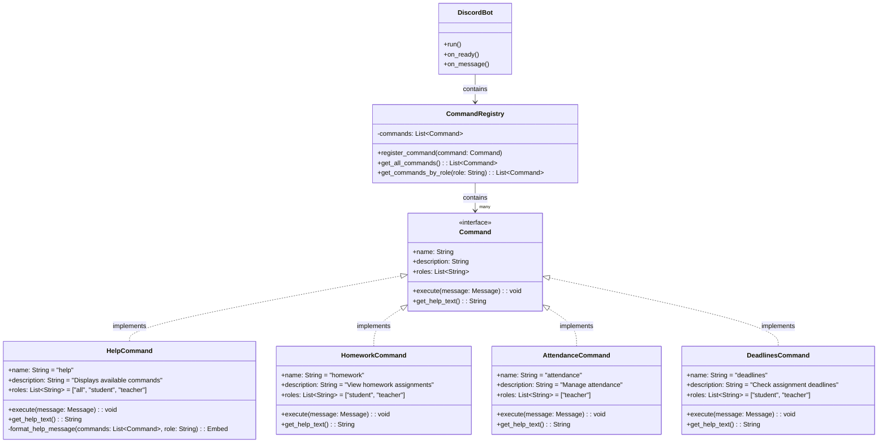

```mermaid
classDiagram
    class DiscordBot {
        +run()
        +on_ready()
        +on_message()
    }
    
    class CommandRegistry {
        -commands: List~Command~
        +register_command(command: Command)
        +get_all_commands(): List~Command~
        +get_commands_by_role(role: String): List~Command~
    }
    
    class Command {
        <<interface>>
        +name: String
        +description: String
        +roles: List~String~
        +execute(message: Message): void
        +get_help_text(): String
    }
    
    class HelpCommand {
        +name: String = "help"
        +description: String = "Displays available commands"
        +roles: List~String~ = ["all", "student", "teacher"]
        +execute(message: Message): void
        +get_help_text(): String
        -format_help_message(commands: List~Command~, role: String): Embed
    }
    
    class HomeworkCommand {
        +name: String = "homework"
        +description: String = "View homework assignments"
        +roles: List~String~ = ["student", "teacher"]
        +execute(message: Message): void
        +get_help_text(): String
    }
    
    class AttendanceCommand {
        +name: String = "attendance"
        +description: String = "Manage attendance"
        +roles: List~String~ = ["teacher"]
        +execute(message: Message): void
        +get_help_text(): String
    }
    
    class DeadlinesCommand {
        +name: String = "deadlines"
        +description: String = "Check assignment deadlines"
        +roles: List~String~ = ["student", "teacher"]
        +execute(message: Message): void
        +get_help_text(): String
    }
    
    DiscordBot --> CommandRegistry : contains
    CommandRegistry --> "many" Command : contains
    Command <|.. HelpCommand : implements
    Command <|.. HomeworkCommand : implements
    Command <|.. AttendanceCommand : implements
    Command <|.. DeadlinesCommand : implements
```